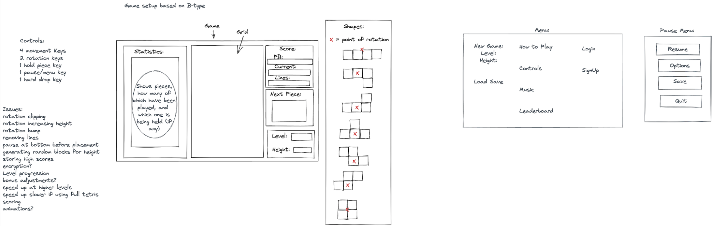

# Tetris Game
SEI57 Project One

## Overview:
My first project in the Software Engineering Immersive Course and my first time coding a game. The project was to code Tetris including shape rotation, scoring, speedup and more.

## Brief:
Goal: Recreate the classic game Tetris.
Timeframe: 1 week.
Group-size: Solo.
Software used: JavaScript, CSS, and HTML. 
Deployed version: [https://kiratarik.github.io/sei-fifty-seven-project-one/](https://kiratarik.github.io/sei-fifty-seven-project-one/)

## Approach:
My approach was to first code some basic styling and HTML framework before working on different parts of the game one at a time, reusing things I had code in previous sections in the new sections. I started out with having all required variables as inputs before switching some of them out with global variables later on. My code eventually grew more and more confusing and harder to debug over time.

Of the options we were given I chose the hardest one: Tetris. First I made a rough wireframe of what I wanted and what I could add and what would be difficult:

