# General Assembly Project 1: Tetris Game
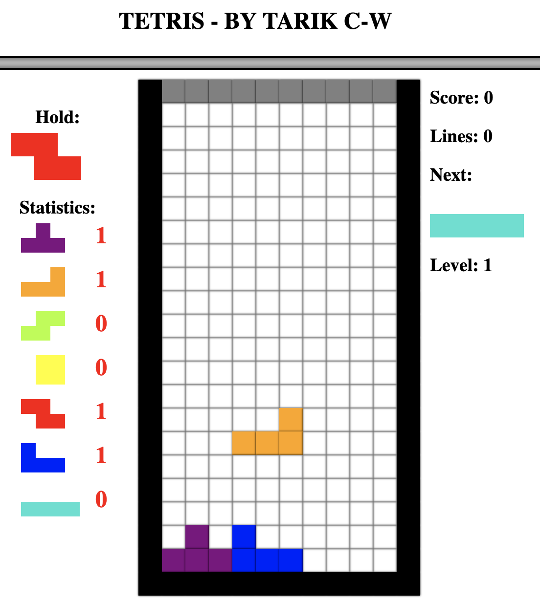

## Table of Contents:
1. [Overview](#overview)
1. [Brief](#brief)
1. [Approach](#approach)
1. [Key Learnings/Takeaways](#key-learningstakeaways)
1. [Future Features](#future-features)
1. [Bugs](#bugs)

## Overview:
My first project in the Software Engineering Immersive Course and my first time coding a game. The project was to code Tetris including shape rotation, scoring, speedup and more.

## Brief:
**Goal:** Recreate the classic game Tetris.

**Timeframe:** 1 week.

**Group-size:** Solo.

**Software used:** JavaScript, CSS, and HTML. 

**Deployed version:** [https://kiratarik.github.io/sei-fifty-seven-project-one/](https://kiratarik.github.io/sei-fifty-seven-project-one/)

## Approach:
My approach was to first code some basic styling and HTML framework before working on different parts of the game one at a time, reusing things I had code in previous sections in the new sections. I started out with having all required variables as inputs before switching some of them out with global variables later on. My code eventually grew more and more confusing and harder to debug over time.

Of the options we were given I chose the hardest one: Tetris. First I made a rough wireframe of what I wanted and what I could add and what would be difficult:

I then made some html structure for everything I had ideas of implementing including stretch goals. Although some of it I ended up not using and I commented it out as I did not have enough time to implement it or knowledge of how to do so yet. The rest I added to as needed while coding the JavaScript. The majority ended up being text and divs with ids that my JavaScript could target.

I then worked on some basic CSS, starting with some basic styling to separate sections, I later went back to make them look a bit nicer.

One of the first things I coded was the grid where the game would take place. In JavaScript I made a function to build the game board grid on load. I eventually coded all of the grids to be built on load.

I then split off a part of the code specifically to do with building grids into its own function so I could use it elsewhere in the code:
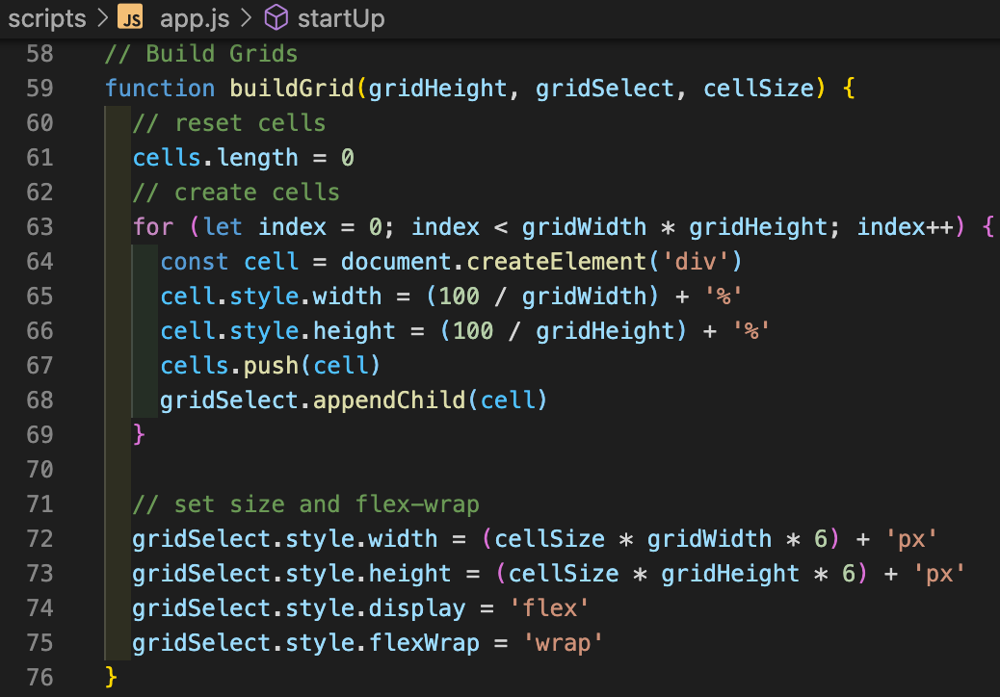

I then worked on a section displaying how many of each shape has appeared called the statistics section. I also later build grids for hold and next sections.

The statistics section required me to design a way to generate each shape in the grid. Originally I had a separate function for each shape, but I later on condensed it into a single function making use of a Class that I also used to store rotations later on. The shapes work by having an origin location point that it can rotate around and thus is always part of the shape with the other three tiles being represented by value modifiers for the position. For example, 1 tile right or left is +1 or -1 grid position respectively. I used a Class instead of an Object because some of the positions were dependent on the gridwidth variable which changed depending on which grid the shape was being generated on:
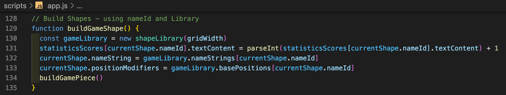
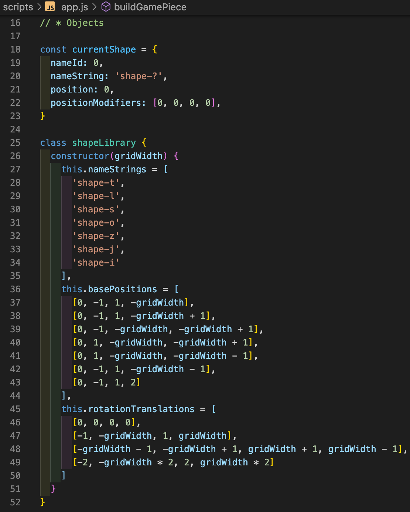

At this point I had set up the statistics section as well as the game board so I then moved on to making the pieces fall. As part of making the pieces fall I had to code a collision checker and a random shape builder. I added several things later including speedup falling and line clearing:
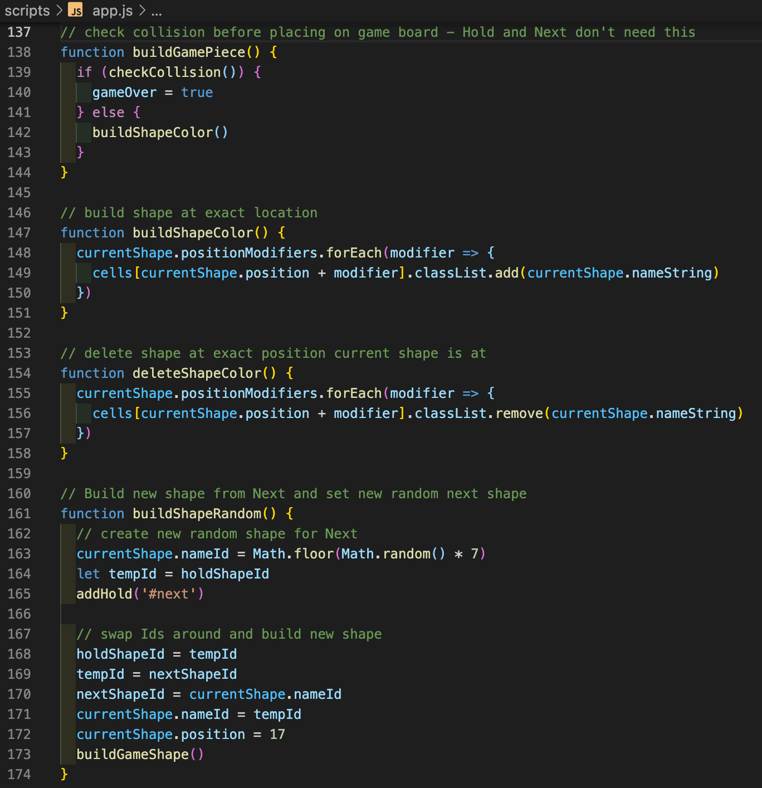

I then started work on controls coding the left and right. I eventually wrote a function for pressing down and pressing up keys which rerouted to the correct function based on which key was pressed.

I then worked on the hold shape function. It was at this point that I went back through my code, clearing things up, adding global variables, and adding the shapeLibrary Class. I then added the next section reusing lots of the hold section to do so, I also had to recode the hold section to make this work. When I added rotations later on, I was unable to easily make it so that the held shapes remembered rotation so I ended up not having rotation for held pieces:
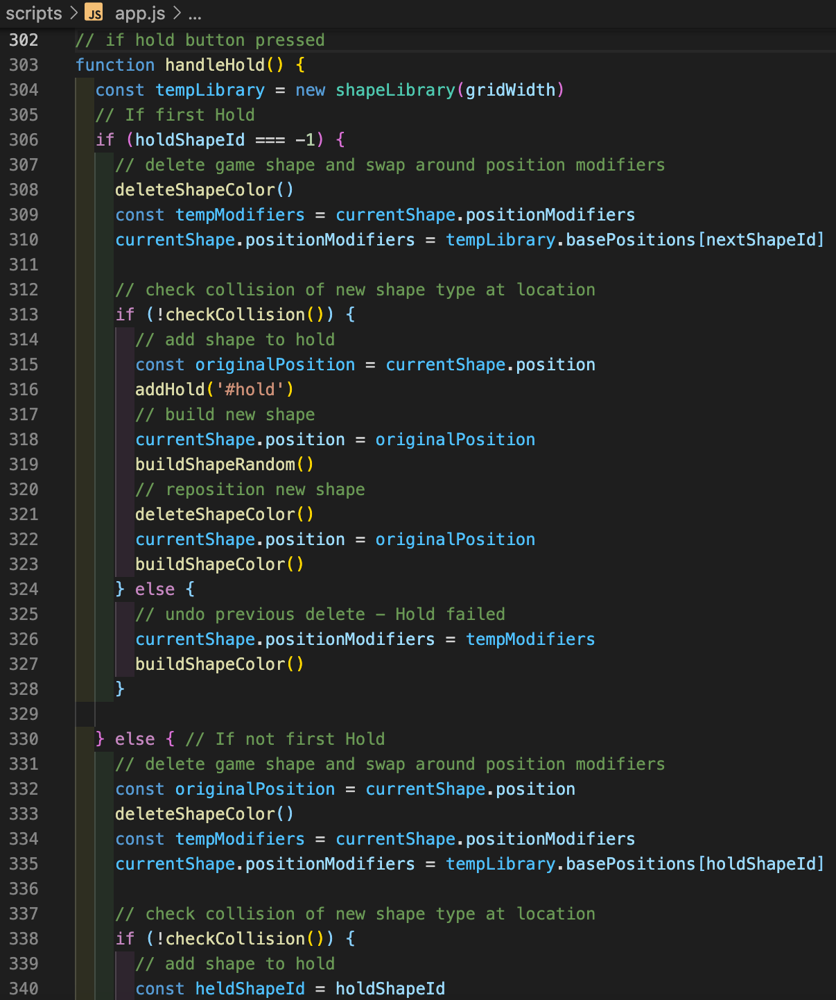
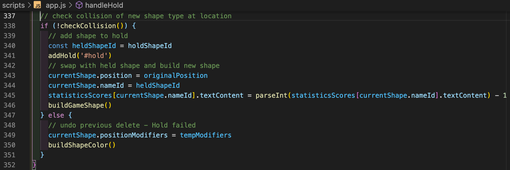

I then added rotations. I found several problems including rotating near the edges of the game board so I also added a border to the game board. My method for rotation used the shapeLibrary to create several arrays, four numbers long, which when you went up or down the list (with a wraparound at the ends) the number changed such that it would look like a 90 degree rotation if applied to all position modifiers up or down the list. Thus the code would check the value of the position modifiers, compare it to the rotationTranslations section in shapeLibrary and replace it with a new value based on values up or down the list:
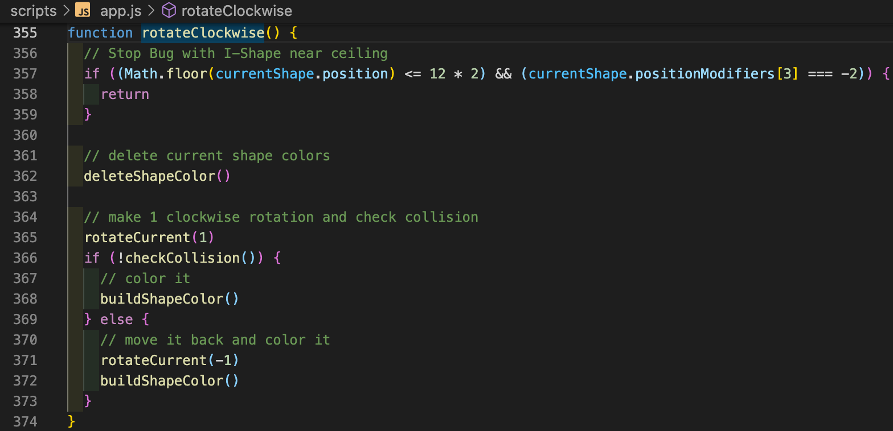
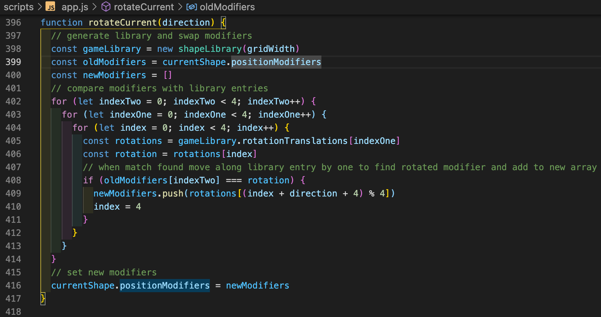
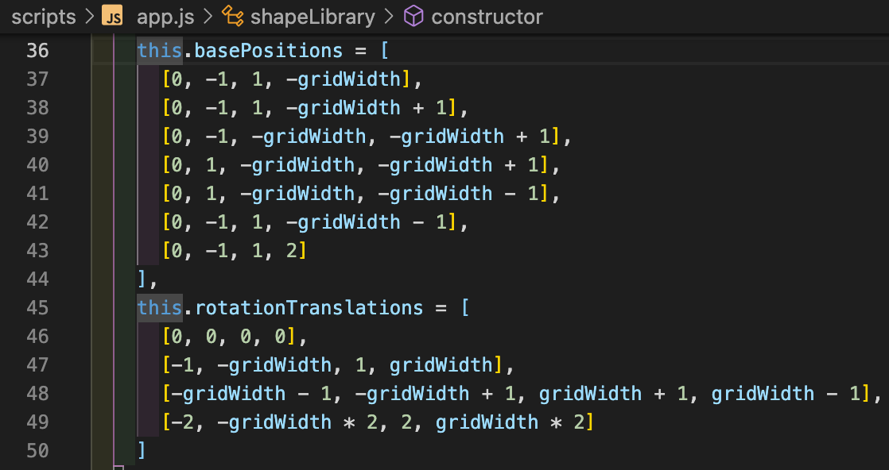

I then added line completion, scoring, and a speeding up of the game over time. The scoring was such that you got more points for multi-line clears and the speedup was such that it was based on how many times lines were cleared and not how many lines were cleared such that it sped up more slowly if you had a lot of multi-line clears:
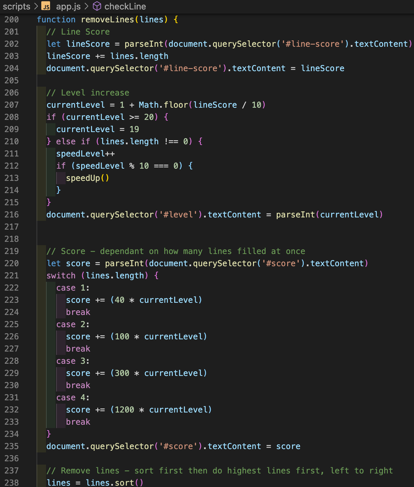
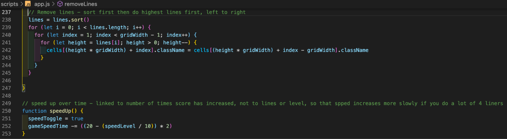

I then added a pause menu, a new game function including a board rest, and a controls menu at the bottom.

## Wins:
A notable win was the rotation system that was generalised to all shapes. It reads the relative locations of the blocks and rewrites the stored locations based on what the relative locations were:

## Challenges:
A notable challenge was getting the hold shape system to work: I was able to implement it in the end, however it resets the rotation of shapes that are held:

## Key Learnings/Takeaways:
A Key learning was to use global variables and to separate the functions more clearly and to annotate more often:

## Future Features:
Future Features are to fix the hold function to allow for rotation, and to set up a menu system that allows you to start the game at different speed levels.

## Bugs:
A notable bug was the game crashing when rotating shapes near the borders of the board. This was fixed by not allowing the shapes to rotate in those circumstances.
